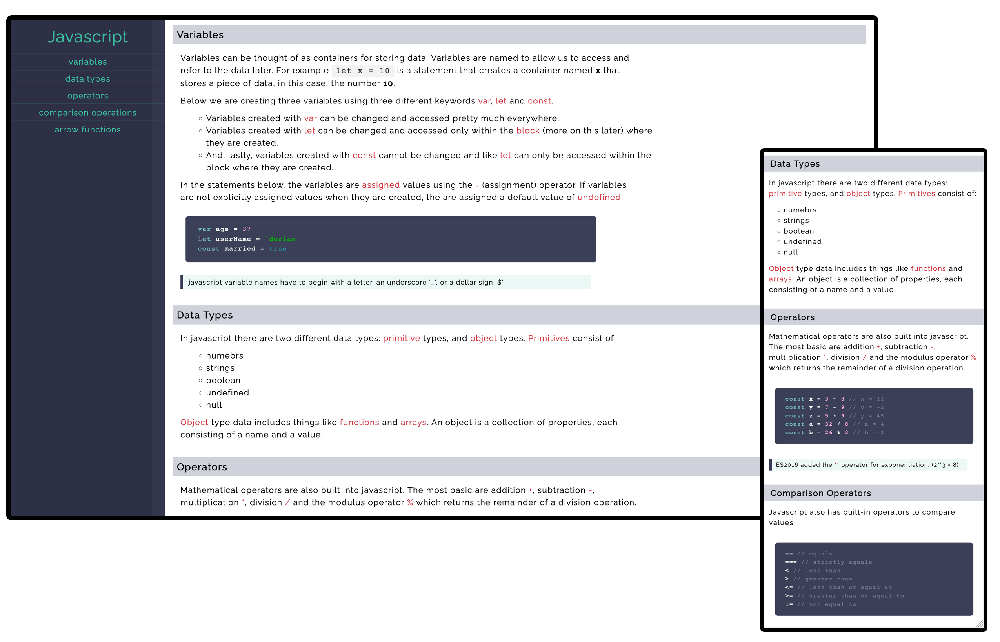

# ReskillAmericans Student Resource Guide

## `About`

### Project Goals

The intent of this project is twofold: to establish a free, accessible, beginner-friendly resource that pools our collective knowledge to assist us, and future cohorts in becoming web-developers, and to give us an environment to practice version control, contributing to open-source, and building an actual project.

And not only will the information contained in the project serve as a learning resource, but the project itself is a resource Crack open the code look around and as we begin to build more, the collaborators and contributers are over on slack ready to explain the hows and whys of everything we build.

### Project Structure

This is still in it's beginning stages so it's not written in stone. But I was inspired largely by [MDN Web Docs](https://developer.mozilla.org/en-US/docs/Web/JavaScript) and [this](https://codepen.io/freeCodeCamp/full/NdrKKL) project that is a part of the responsive design course over on [freeCodeCamp's](https://freecodecamp.org) site. Again, not married to any of this and suggestions are welcome.

## `How to Help`

### Contact us

Reach out to any of the collaborators, [@Ana Vela ](https://github.com/ana-vela), [@Amy ](https://github.com/beloved) and [@dorian](https://github.com/buddafucofibas), over on the ReskillAmericans slack workspace or on github.

### What you can do

Contribute what you can! If you have notes to add based on your knowledge or what you're learning in the ReskillAmericans course you can contribute. If there are some stylistic changes you think would be neat or some html that needs tweaking, you can contribute. If you're getting your hands wet with client side javascript and you wanna jazz up the page you can also contribute. And as we learn more, we'll be able to do more and hopefully build something that will serve as a additional go-to resource for all future cohorts of ReskillAmericans.

### HOW to contribute

Make a `pull request`, if you're uncertain how to, [this](https://github.com/firstcontributions/first-contributions) is a great resource to get started. At this early stage since we haven't covered much back-end stuff, if you want to begin a whole new section covering front end, UI/UX, or backend python or PHP, begin with a new html and stylesheet and we can directly link everything together via anchor tags.

## `Preview`

### Javascript

Javascript section

